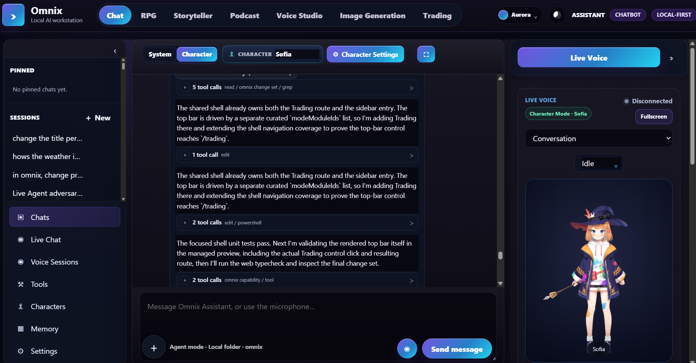
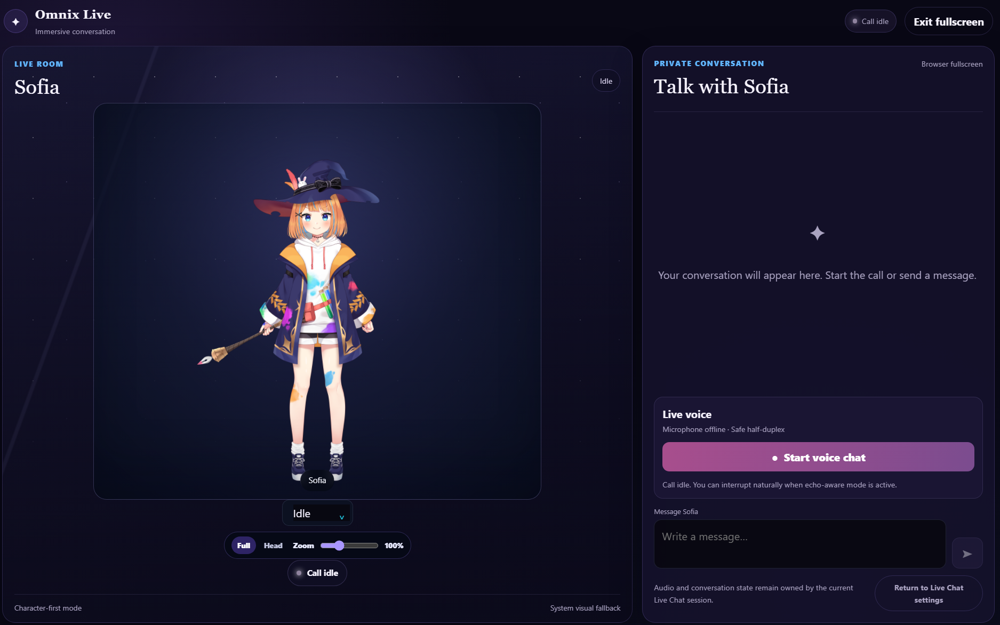
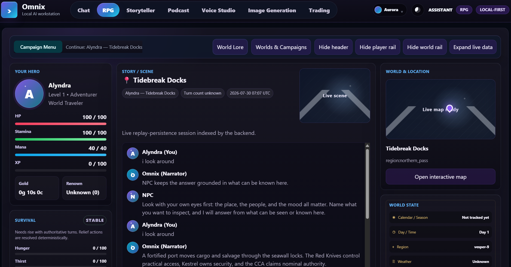
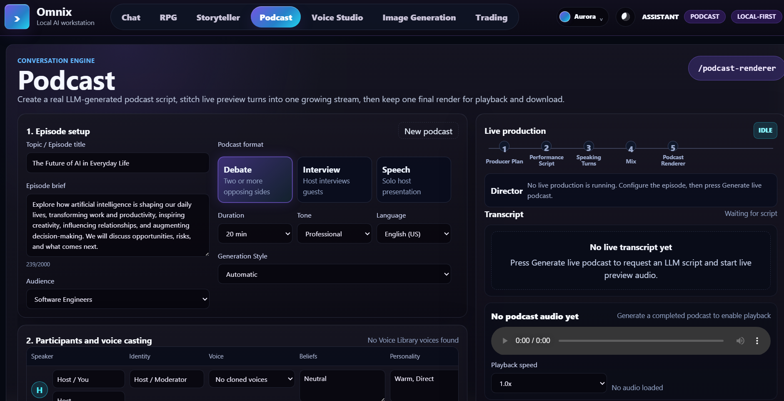
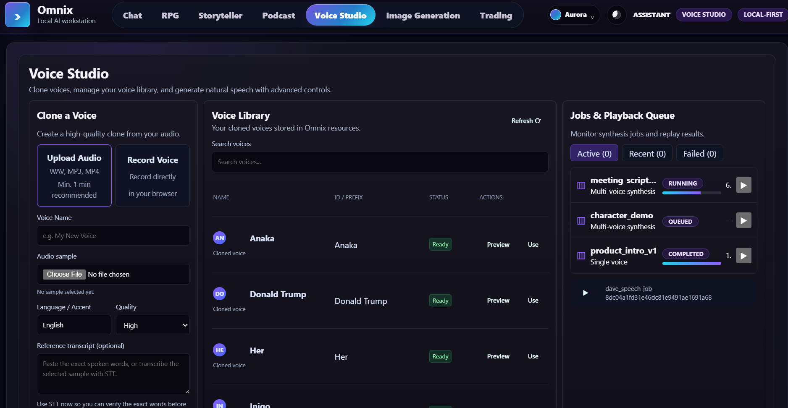
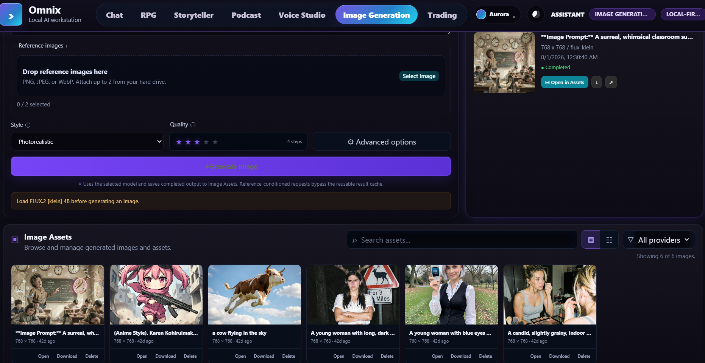
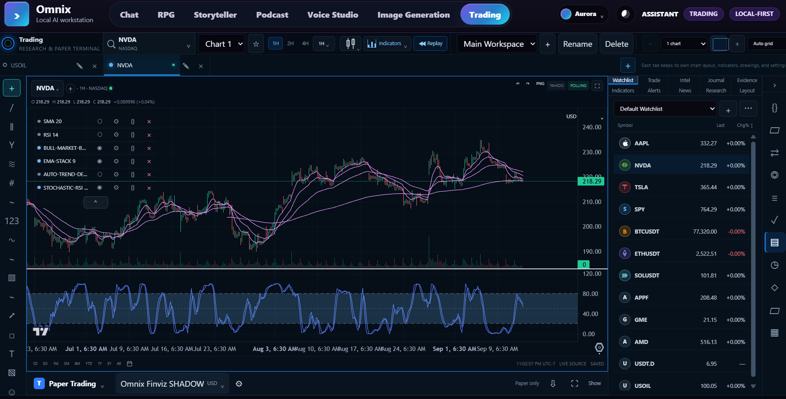

# Omnix

> A local-first AI workstation for chat, live conversation, deterministic RPG, long-form storytelling, podcast production, voice synthesis, image generation, trading research, and governed agent workflows.

Omnix brings creative work, research, automation, and operational visibility into one React application backed by FastAPI and PostgreSQL. Feature modules share the same provider/model registry, jobs and runs, assets and artifacts, settings, diagnostics, and event infrastructure.

[Open the documentation portal](docs/index.html) · [Browse the feature catalog](docs/FEATURES.md) · [Read the architecture](docs/ARCHITECTURE.md)

## What Omnix includes

- A shared React + TypeScript + Vite browser application under `src/apps/web`.
- A FastAPI gateway with typed Pydantic contracts, service boundaries, and compatibility handoffs.
- PostgreSQL as the supported authoritative structured-data runtime.
- Local or remote provider integrations for LLM, TTS, STT, image, market-data, and governed external capabilities.
- Durable jobs/runs for long-running work, progress, logs, cancellation, retries, and resource ownership.
- Shared assets, reports, and artifact references for generated media and documents.
- Shared SSE events and WebSocket-capable realtime paths for progress and live conversation.
- A governed assistant and agent runtime with scoped capabilities, evidence, acceptance, review, and recovery.

## Workspace tour

The main mode switcher exposes seven primary workspaces. The screenshots below are repository assets in `docs/images`; runtime data, provider status, and available controls vary by local configuration.

### Chat and Assistant

Chat is the primary conversational surface at `/chatbot`. It supports persistent sessions, System or Character identity, provider/model selection, streaming responses, image and text context, memory, research, governed tools, artifacts, and long-running agent runs.



Typical path:

1. Start or resume a session and choose the identity mode.
2. Confirm the provider, model, voice, and research defaults.
3. Send a prompt, attach supported context, or open Live Chat.
4. Review streamed output, tool calls, jobs, citations, and artifacts.
5. Keep durable results in sessions, assets, reports, or generated documents.

The browser owns presentation, drafts, filters, and playback controls. Session state, jobs, capability grants, generated outputs, and authoritative context remain backend-owned.

### Live Chat and live conversation

Live Chat is the immersive/fullscreen conversation surface connected to Chat. It combines a live room, character presence, private transcript, microphone capture, text fallback, turn timing, interruption handling, and TTS playback.



A live turn crosses several boundaries: browser input and device state, STT capture, session turn coordination, provider/model response, accepted-final routing, TTS delivery, transcript persistence, and diagnostics. A reachable worker does not by itself prove that the complete turn is ready.

### RPG (work in progress)

RPG is a deterministic simulation at `/rpg`. AI helps with presentation and interaction, but it does not own the game state. The route includes campaign/session selection, hero and party state, survival and equipment, world/location panels, objectives, journal, combat, structured turns, replay/checkpoints, reports, world authoring, and optional Hermes suggestions.



> **Work in progress:** the deterministic session and structured turn foundations are active while content completeness, generated artwork, world enrichment, and some authoring/editor flows continue to evolve. Treat placeholder presentation and optional generated media as non-authoritative until the corresponding backend state is accepted.

RPG workflow:

1. Create or select a world, campaign, and active session.
2. Review the player, party, location, world state, and available actions.
3. Submit a structured turn or choose a quick action.
4. Wait for the authoritative result and inspect the narrative/combat readout.
5. Review journal, objectives, replay state, reports, and any accepted generated assets.
6. Treat Hermes output as reviewed proposals, never as a replacement for deterministic RPG state.

### Storyteller

Storyteller is the long-form writing workbench at `/storyteller`. It combines local editing continuity with server-backed generation actions and a story library. Use it for premise development, drafting, revision, chapter/scene organization, interactive moves, reading, narration, and export.

The workflow is:

1. Enter a title and premise, then choose writing mode, tone, and style.
2. Generate or edit a draft and derive chapters/scenes from the document.
3. Apply targeted actions such as continue, rewrite paragraph, expand scene, dialogue polish, and summarize.
4. Select chapters/scenes and keep the document organized in the story library.
5. Optionally assign voices, generate narration or chapter audio, and export shared assets.

No dedicated Storyteller screenshot is currently present in `docs/images`; the feature catalog documents the current route and output model in more detail.

### Podcast

Podcast turns an episode brief and participant configuration into a staged multi-speaker production at `/podcast`.



Configure topic, audience, duration, format, tone, language, speaker identities, beliefs, personalities, styles, goals, instructions, and voices. Review the generated script before audio production. The shared pipeline is producer plan, performance script, speaking turns, mix, and renderer. Live previews and final renders are separate outputs; final audio is stored as a shared asset.

### Voice Studio

Voice Studio is the main TTS production surface at `/voice`. It separates reusable voice identity from synthesis jobs: voice profiles live in the library, scripts define content, and jobs produce audio assets with playback and recovery state.



Use Voice Studio to:

- Create single-speaker or multi-speaker scripts.
- Search, preview, and assign reusable voice profiles.
- Assign a speaking style for each speaker.
- Tune stability, similarity, style, speed, pitch, volume, and effects.
- Submit TTS jobs and follow resource class, stages, logs, progress, and output references.
- Compare active, recent, and failed jobs, then retry or recover.

TTS readiness requires a usable voice profile, a provider advertising TTS capability, valid speaker segments, a reachable worker, and compatible output settings.

### Image Generation

Image Generation at `/image-generation` makes model residency explicit. A healthy service process may still have no model loaded, so download completeness, load state, worker readiness, and GPU/resource availability are checked before generation.



Workflow:

1. Discover image-capable providers and models.
2. Check download, completeness, load, worker, and resource state.
3. Download missing files when permitted and explicitly load the selected model.
4. Enter a prompt and optional reference images, then submit an image job.
5. Follow generation and asset-storage stages through shared events.
6. Open the latest result or Image Assets gallery and retain prompt/provider/model metadata.

Unload heavyweight models when reclaiming GPU memory. Provider credentials, including gated model tokens, belong in protected environment/configuration storage.

### Trading

Trading is a charting, research, replay, alerting, strategy, and paper-simulation workstation at `/trading`. It is deliberately separated from unrestricted broker mutation authority.



The trading workflow is:

1. Select an instrument, provider binding, data source, and supported interval.
2. Configure chart tabs/layouts, chart type, indicators, drawings, and linked panels.
3. Add watchlists, comparisons, alerts, scanner criteria, or research context.
4. Use replay and backtest tools to test a hypothesis against historical data.
5. Review AI/Hermes analysis with its provenance and research context.
6. Use the paper-trading surface only with an explicitly configured paper account.

Market data provenance, chart workspace state, paper balances, orders, positions, and simulated fills are backend-owned or provider-owned according to their contract. AI analysis is research until a deterministic strategy/runtime explicitly owns execution authority.

## Shared platform model

Most feature work follows the same lifecycle:

```text
User input
  -> route through the shared gateway
  -> select domain service, provider, model, capability, or job
  -> execute inline or as a durable job/run
  -> stream progress and state through SSE or WebSocket
  -> persist structured truth in PostgreSQL
  -> register media/documents as shared assets or reports
  -> render, review, accept, retry, or recover
```

### Providers and models

Providers describe connection and capability families. Models describe selectable implementations, location, resource hints, health, and defaults. Feature code should select by capability through the shared registry instead of embedding provider-specific branching in every workspace.

### Jobs and runs

Use the shared job/run model for work that needs progress, cancellation, retries, logs, resource scheduling, or durable recovery. Jobs carry module/type identity, resource class, input references, semantic stages, status, progress, logs, and output references.

### Assets, reports, and artifacts

Generated audio, images, transcripts, stories, reports, exports, checkpoints, and other durable outputs are indexed through shared asset/artifact contracts. PostgreSQL stores structured metadata and relationships; large binary content remains in file/blob storage and is referenced by the asset record.

### Settings and diagnostics

Settings expose the supported configuration surface with scope, owner, writeability, application timing, and restart semantics. Diagnostics correlate gateway health, workers, providers, model residency, event streams, jobs, logs, and persistence without creating a second source of truth.

## Architecture

```text
Browser: React + TypeScript + Vite
  | typed API client, Query cache, UI state, design system, events
  v
FastAPI gateway
  | domain services, providers, jobs, assets, reports, settings, diagnostics
  | agent runtime, capability broker, compatibility handoff
  +--> PostgreSQL: authoritative structured state, migrations, recovery
  +--> blob/artifact storage: media, reports, exports, model resources
  +--> local or remote services: LLM, TTS, STT, image, Hermes, market data
```

The browser renders backend truth and submits intent. Backend services own domain state, capability authority, acceptance, evidence, review subjects, and recovery decisions. Model output is a proposal or evidence, not authority.

## Run Omnix locally

### Prerequisites

- Git.
- A supported Python version for the repository dependencies.
- Python, `pip`, and a virtual environment or Conda environment.
- Node.js and npm.
- Docker Desktop or another Docker-compatible runtime for PostgreSQL.
- Optional GPU/runtime dependencies for local LLM, TTS, STT, or image services.
- Optional provider credentials for remote APIs, gated model downloads, market data, or integrations.

### 1. Start PostgreSQL

PostgreSQL is the supported structured runtime database. Start the repository service:

```powershell
docker compose -f docker-compose.postgres.yml up -d
```

Set the connection URL without committing credentials:

```powershell
$env:OMNIX_DATABASE_URL = "postgresql://omnix:<password>@127.0.0.1:5432/omnix"
```

Run migrations and verify persistence:

```powershell
$env:PYTHONPATH = "src"
python -m app.persistence migrate
python -m app.persistence verify
```

### 2. Start the FastAPI gateway

PowerShell:

```powershell
$env:PYTHONPATH = "src"
python -m uvicorn app.gateway.main:app --host 127.0.0.1 --port 8000
```

Bash, Linux, macOS, or WSL:

```bash
export PYTHONPATH=src
python -m uvicorn app.gateway.main:app --host 127.0.0.1 --port 8000
```

Verify `http://127.0.0.1:8000/api/health` before diagnosing feature-specific failures.

### 3. Install and start the web app

In another terminal:

```bash
npm install
npm run web:dev
```

Open `http://localhost:5173/`. Vite proxies `/api` and `/events` to the gateway on port `8000`.

### Default local service map

| Service | Default port | Role |
| --- | ---: | --- |
| Web / Vite | `5173` | Browser application and development proxy |
| FastAPI gateway | `8000` | API, events, orchestration, and diagnostics |
| PostgreSQL | `5432` | Authoritative structured persistence |
| Launcher dashboard | `5055` | Optional Windows service control |
| TTS worker | `5101` | Speech synthesis |
| STT worker | `5201` | Transcription |
| Image service | `5301` | Image generation and model residency |
| Hermes sidecar | `8642` | Optional proposal/planning assistance |

Heavy model dependencies can run in separate processes, environments, or containers. The service boundary and environment variables are the contract; workstation-specific absolute paths are not.

## Providers, credentials, and optional services

Configure provider defaults through Settings and the relevant environment variables. Keep API tokens, database passwords, Hugging Face credentials, and integration secrets out of source, screenshots, browser storage, and committed fixtures.

For LM Studio authentication:

```powershell
$env:LM_API_TOKEN = "your-lm-studio-token"
```

Hermes is optional and runs as a sidecar. Setup helpers are available for Windows and POSIX environments:

```powershell
.\scripts\setup_hermes.ps1
```

```bash
bash scripts/setup_hermes.sh
```

Leave `HERMES_ENABLED=false` until the sidecar is reachable. Omnix retains capability/policy authority and application state.

## Development workflow

1. Read [ARCHITECTURE.md](docs/ARCHITECTURE.md) to find the owning layer.
2. Read [FEATURES.md](docs/FEATURES.md) to understand the user-facing workspace and shared concepts.
3. Make the smallest coherent change in the shared app/service boundaries.
4. Add focused regression coverage for behavior and failure modes.
5. Regenerate API contracts when backend schemas change.
6. Add forward PostgreSQL migrations for persistence changes.
7. Inspect the complete diff and run validation after the final mutation.

New browser UI belongs under `src/apps/web`. Reuse the typed API client, shared event client, provider/model registry, jobs/runs, assets/artifacts, settings, diagnostics, and capability policy. Do not add new behavior to the retired classic template/static browser UI.

### Useful commands

```bash
npm run web:typecheck
npm run web:test
npm run web:test:e2e
npm run web:build
npm run web:preview
python -m pytest src/tests/unit -q --tb=short
```

For trading-focused frontend checks:

```bash
npm run test:trading
npm --workspace @omnix/web run typecheck:trading
npm --workspace @omnix/web run test:e2e:trading
```

## Documentation

The repository keeps Markdown as editable source and generates browser-facing HTML counterparts:

- [Documentation portal](docs/index.html)
- [Documentation overview](docs/README.md) · [HTML](docs/README.html)
- [Feature catalog](docs/FEATURES.md) · [HTML](docs/FEATURES.html)
- [Architecture guide](docs/ARCHITECTURE.md) · [HTML](docs/ARCHITECTURE.html)
- [Setup guide](docs/SETUP.md) · [HTML](docs/SETUP.html)
- [Development guide](docs/DEVELOPMENT.md) · [HTML](docs/DEVELOPMENT.html)
- [Operations guide](docs/OPERATIONS.md) · [HTML](docs/OPERATIONS.html)
- [Hermes sidecar setup](docs/HERMES_SIDECAR_SETUP.md) · [HTML](docs/HERMES_SIDECAR_SETUP.html)
- [Platform specification](SPEC.md) · [HTML](SPEC.html)

After changing a Markdown source, regenerate the HTML pages from the repository root:

```bash
python docs/render_docs.py
```

Screenshots belong under `docs/images` and should be referenced with repository-relative Markdown paths. The renderer converts those images into responsive, captioned HTML figures and rewrites internal Markdown guide links to `.html` targets.

## Safety and authority boundaries

- PostgreSQL is the supported structured runtime database.
- The browser is not the authoritative store for sessions, RPG state, paper accounts, jobs, assets, or settings consumed by other processes.
- LLM/Hermes output does not grant tools, credentials, network access, destructive effects, or trading execution authority.
- Capability grants are explicit and scoped; approval policy cannot expand issued authority.
- Trading AI remains research or paper analysis unless deterministic execution policy explicitly owns the effect.
- Optional services may be unavailable without invalidating the core web shell.

## Project map

```text
src/apps/web/           React workspaces, routing, API clients, state, events, tests
src/app/gateway/        FastAPI browser/API boundary
src/app/providers/      Provider and model integration layer
src/app/jobs/           Shared job/run contracts and stores
src/app/assets/         Shared asset/artifact handling
src/app/rpg/            Deterministic RPG domain and APIs
src/app/trading/        Market data, research, replay, alerts, strategies, paper state
src/app/agent_runtime/  Planning, grants, execution, evidence, review, recovery
src/app/persistence/    PostgreSQL runtime, migrations, repositories, blob storage
docs/                   Human-maintained guides and generated HTML references
docs/images/            Workspace screenshots used by the docs
resources/              Models, examples, logs, and runtime resources
```

## Status

Omnix is actively evolving. The core web shell, shared platform contracts, feature workspaces, and documentation portal are in active development. RPG content/world authoring and optional model/service integrations should be treated as work in progress and environment-dependent.
