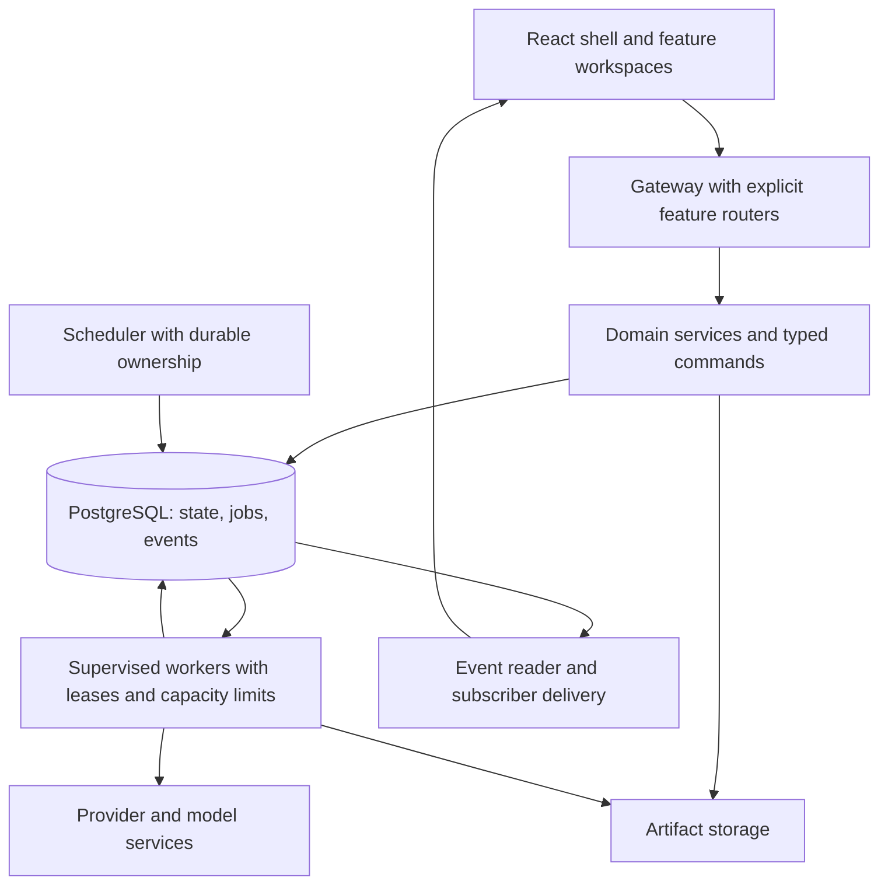

# Omnix framework and infrastructure review

Date: 2026-09-26  
Source revision inspected: `d71b55a09`  
Scope: architecture, scalability, maintainability, performance, and expansion patterns.

## Recommendation

Keep Omnix as a modular application with explicitly composed services and independently
supervised workers. Make the existing PostgreSQL job ledger the common execution
boundary. Give each feature a small public contract, explicit dependencies, and an
owned lifecycle.

The platform already has useful foundations: authoritative PostgreSQL state, a Unit
of Work, job leases, transactional events, shared assets, provider abstractions,
generated API types, lazy React workspaces, and deterministic authority checks.
The main debt is how those foundations are connected. Import order, global patches,
process-local execution, and browser-wide controllers now carry substantial behavior.

The first work should fix startup consistency, blocking gateway operations, recovery
ownership, incomplete collection queries, and stale infrastructure references. These
are observable contract/correctness issues, not speculative speed improvements.

## Scope and confidence

This is a static architecture review with repository-wide source inventory and
focused call-path inspection. Runtime load tests, database query plans, external
provider calls, and fresh benchmark runs were not performed. Throughput limits,
latency improvements, and effort sizes below are hypotheses or planning estimates
until measured. This review changes documentation only.

The primary assumption is a local workstation growing in feature count and workload.
Small-team and hosted deployment requirements are described separately. A feature
or adapter being named `legacy`, `v2`, or `compat` is not evidence that it can be deleted.

### Inventory signals

Counts are from tracked files, excluding backend vendor code and embedded backend
tests, and excluding frontend tests and generated types where stated.

| Signal | Observation | Interpretation |
| --- | ---: | --- |
| Backend Python source files | 2,615 | Boundaries and discoverability matter more than directory count |
| Gateway Python files | 99 | Gateway composition has become a platform concern |
| Backend files assigning `FastAPI.__init__` | 48 | Application assembly depends on global constructor wrapping |
| Frontend source files | 787 | Expansion needs consistent ownership and lifecycle rules |
| Frontend files replacing `window.fetch` | 17 | Transport behavior has several global owners |
| Frontend files constructing `MutationObserver` | 19 | React state and externally injected DOM coexist |
| Frontend files using `setInterval` | 28 | Background work needs explicit activation and disposal |
| RPG session runtime numbered parts | 40 | Physical splitting has not established independent modules |
| Backend occurrences of `include_in_schema=False` | 291 | Audit which browser contracts escape generation; some exclusions are intentional |
| Python files under `src/tests` | 2,585 | File count alone does not establish effective coverage |
| CI workflows | 27 | Consolidate common platform gates while preserving specialized checks |

These counts describe source patterns, not the number of live wrappers, active timers,
unique routes, defects, or measured bottlenecks.

## Findings, ordered by priority

P1: address before increasing concurrency or relying on deployment gates.  
P2: planned refactoring with meaningful performance or maintenance benefit.  
P3: conditional expansion work.

### R1 — P1: Supported entrypoints do not establish the same persistence authority

**Evidence:** [scripts/run_omnix_gateway.py](../scripts/run_omnix_gateway.py) calls
`bootstrap_status_payload()` before Uvicorn imports the app. In contrast,
[src/main.py](../src/main.py), [src/launch.py](../src/launch.py), and direct imports of
`app.gateway.main:app` do not perform that bootstrap. The gateway factory captures
default factories when constructed. [jobs/store.py](../src/app/jobs/store.py) defaults
to the test `InMemoryJobStore`; [runtime_install.py](../src/app/persistence/runtime_install.py)
replaces those factories only during explicit bootstrap.

**Impact:** The documented launch method can change which stores and handlers are
installed. A provider-free `/health` response does not prove PostgreSQL authority
was established. Bootstrapping after the app has captured imported defaults is also
not a reliable repair.

**Action:** Create one production composition function used by every launcher and
worker entrypoint. Supply production services explicitly; require explicit test
services for provider-free applications. Separate liveness from readiness, and make
readiness verify the required persistence/runtime state. Own pool shutdown there too.

**Acceptance:** Every production entrypoint refuses to serve authoritative requests
when PostgreSQL is unavailable and receives the same service implementations. Test
factories remain provider-free without process-global substitutions.

### R2 — P1: Synchronous work still runs inside async gateway paths

**Evidence:** [gateway/main.py](../src/app/gateway/main.py), line 361, calls synchronous
`list_events()` directly inside the async SSE loop. Several async job routes also
call synchronous stores directly. [workers.py](../src/app/gateway/workers.py), line
275, probes workers sequentially with blocking `urlopen`. The existing
[blocking_route_offload.py](../src/app/gateway/blocking_route_offload.py) compensates
for selected routes by replacing FastAPI dependant calls and running coroutines in
a new event loop on a worker thread.

**Impact:** Slow database or worker calls can delay unrelated socket delivery on the
same event loop. The corrective allow-list covers specific methods and paths; it
does not make all synchronous operations safe.

**Action:** Declare synchronous request handlers as `def`, or offload the synchronous
service boundary explicitly from streaming/async handlers. Give provider and
database work bounded executors and timeouts. Probe health concurrently with bounded
parallelism or return a sampled health snapshot. Preserve genuine async operations.
FastAPI documents the distinction between ordinary handlers and blocking calls made
inside async handlers in its [async guidance](https://fastapi.tiangolo.com/async/).

**Acceptance:** Slow database/provider simulations cannot stall unrelated live audio;
event-loop lag and executor queue delay are recorded under mixed workload.

### R3 — P1: Chat startup recovery is unsafe for multiple gateway processes

**Evidence:** [generation_jobs.py](../src/app/chat/generation_jobs.py), line 378,
recovers every visible nonterminal inline chat job by failing or canceling it.
It checks neither an owning process heartbeat nor a lease expiry. The gateway
lifespan invokes recovery on startup. Chat dispatch queues, submission locks,
commit locks, and cancellation events are process-local.

**Impact:** Starting another gateway against the same workspace can classify work
owned by the first gateway as abandoned. Rolling restarts and horizontal scaling
therefore require more than adding Uvicorn workers. The scan also sees at most 500
recent jobs and can omit older unfinished work.

**Action:** Give executing chat jobs durable ownership, leases, and fenced writes.
Recover expired ownership through a targeted query, not all running jobs. Preserve
session turn ordering with durable coordination. Keep process-local caches as
optimizations. During migration, enforce the single gateway process constraint.

**Acceptance:** Starting process B does not fail process A's active turn; a dead owner
is reclaimed; a late completion from that owner cannot overwrite a newer turn.

### R4 — P1/P2: Job persistence and job execution are still coupled

**Evidence:** [inline_feature_jobs.py](../src/app/jobs/inline_feature_jobs.py), line 33,
wraps `create_job`; story and podcast execution can complete synchronously before
creation returns. [voice_inline.py](../src/app/jobs/voice_inline.py), line 38, does
the same for synthesis and cloning. Image execution starts a daemon thread per job;
its semaphore limits generation, but does not bound waiting thread creation.
Chat has four dispatcher workers, with unbounded pending session queues.

**Impact:** The same submission API can mean either enqueue or execute. Slow work
holds request capacity, accepted work can accumulate without a common admission
policy, and daemon-thread lifecycle differs between features.

**Action:** Make submission persist and return an accepted job. Use a typed handler
registry and leased workers for execution. Reuse the claim/fencing mechanisms in
[job_repository.py](../src/app/persistence/job_repository.py) and the worker pattern in
[audiobook/worker.py](../src/app/audiobook/worker.py). Run bounded local workers under
the existing launcher first; separate processes can use the same contracts later.
Preserve interactive chat/live voice latency as a distinct execution class.

**Acceptance:** Submission latency does not include generation; queues have capacity
and overload behavior; cancellation, retries, restart recovery, and output publication
follow one documented execution contract.

### R5 — P1/P2: Scheduling and GPU capacity are not owned across processes

**Evidence:** [trading_routes.py](../src/app/gateway/trading_routes.py) registers many
monitors on each app instance. For example, [paper_monitor.py](../src/app/trading/paper_monitor.py),
line 433, guards startup through `gateway.state`, which is local to that app.
Image concurrency uses a process-local semaphore. The PostgreSQL compatibility
`claim_next` in [job_compat.py](../src/app/persistence/job_compat.py), line 110,
discards `residency` and `residency_policy`; the durable claim query filters runnable
jobs but does not establish a general device-wide resource allocation policy.

**Impact:** Additional gateway processes can duplicate scheduled provider polling
and increase effective concurrency against the same device. This does not prove
duplicate financial effects—some operations have idempotency—but ownership of the
background work itself is not coordinated at these boundaries.

**Action:** Assign scheduled work to a supervised scheduler or durable leader lease.
Track permits by worker host/device/resource, with bounded memory and concurrency
budgets. Keep realtime speech priority separate from offline chapter/image work.
Do not widen trading or agent authority while moving execution ownership.

**Acceptance:** Two gateway instances do not independently run the same schedule;
two workers sharing one GPU honor one capacity policy; expired owners release permits.

### R6 — P1: Collection adapters lose pagination and filter after truncation

**Evidence:** [asset_compat.py](../src/app/persistence/asset_compat.py), line 32,
requests only the newest 500 assets. The underlying
[asset_repository.py](../src/app/persistence/asset_repository.py), line 116, already
supports a `(created_at, id)` cursor and asset type filtering. The image gallery
filters that capped aggregate in Python in
[image_workspace_routes.py](../src/app/gateway/image_workspace_routes.py), line 64.
Chat recovery and cancellation searches also inspect capped recent job lists.

**Impact:** Older images can disappear from a feature query when newer unrelated
assets fill the global cap. Increasing the cap merely moves the boundary and expands
payloads; it does not establish complete browsing or reliable active-work lookup.

**Action:** Expose cursor pagination and type/module filters through repository,
service, and API layers. Query active jobs by session/type/status explicitly. Add
indexes based on the resulting query plans; preserve stable ordering and workspace
scope. Summaries should be projections, with content fetched on demand.

**Acceptance:** A library containing more than 500 mixed assets remains completely
browsable; newer unrelated assets cannot hide image results; recovery finds all
eligible jobs without scanning arbitrary recent history.

### R7 — P2: Replace global runtime patching with explicit composition

**Evidence:** [gateway/__init__.py](../src/app/gateway/__init__.py) installs many hooks
on import. Route installers wrap `FastAPI.__init__` and identify the intended app
by its title. [runtime_install.py](../src/app/persistence/runtime_install.py) mutates
module exports, classes, and `sqlite3.connect`. The gateway also removes and
re-registers hook-installed routes to apply injected factories.

**Impact:** Dependency injection is partial, import order affects implementations,
and constructing a test app can initialize unrelated domains. A feature addition
requires understanding hidden constructor and method wrapper chains.

**Action:** Introduce a small `RuntimeServices` composition object and explicit
feature registration functions. Inject repository/worker/provider protocols into
services. Register routers once from an enabled-feature catalog. Replace global
class substitutions incrementally, preserving PostgreSQL fail-closed behavior.
Compose startup/shutdown using one lifespan; this matches
[FastAPI's lifecycle guidance](https://fastapi.tiangolo.com/advanced/events/).

**Acceptance:** Two differently configured apps can coexist in one interpreter;
route registration does not change framework classes; each feature can be composed
with narrow test services and no unrelated workers.

### R8 — P2: Browser runtimes initialize without a matching route disposal boundary

**Evidence:** [viewRuntime.ts](../src/apps/web/src/app/viewRuntime.ts) caches initialization
promises and calls many initializers without retaining their cleanup functions.
[router.tsx](../src/apps/web/src/app/router.tsx), line 82, initializes the active
module without a cleanup return. Some controllers, such as
[desktop-companion-controls.ts](../src/apps/web/src/features/assistant-workspace/desktop-companion-controls.ts),
already return cleanup functions that this path discards. Others globally wrap
fetch, inject DOM, or install observers/timers. The browser API firewall compensates
for cross-workspace requests after initialization.

**Impact:** Visiting a workspace can leave its controllers installed for the rest
of the page lifetime. Feature order becomes relevant to transport behavior. The
firewall is useful containment but is not a lifecycle or server authorization boundary.

**Action:** Separate code loading from runtime activation. Give each runtime
`activate(context)` and `dispose()`, retaining cleanup through React effects. Put UI
elements in React components and use explicit transport middleware at the shared
client. Keep genuinely global services explicit and independent of route disposal.
React describes paired setup/cleanup for external systems in its
[effect guidance](https://react.dev/reference/react/useEffect).

**Acceptance:** Navigating Chat → Trading → Chat produces one active set of relevant
controllers, without accumulating listeners, timers, observers, or transport wrappers.

### R9 — P2: SSE performs a database poll for each subscriber

**Evidence:** [gateway/main.py](../src/app/gateway/main.py), line 356, owns a polling
loop per SSE connection. The idle interval is one second. The durable
[job_runtime_compat.py](../src/app/persistence/job_runtime_compat.py) reads event rows
from PostgreSQL on each iteration. The frontend event client already supports
reconnect, jitter, subscriber cleanup, and replay cursors.

**Impact:** With N idle open connections, the current loop produces approximately
N event-read queries per second, before unrelated polling. This is a code-derived
estimate, not a measured capacity limit. Backlog replay currently has no explicit
per-client delivery budget in that loop.

**Action:** Use one event reader per process/workspace with subscriber fan-out.
Use durable events/outbox as truth; notifications can wake the reader. Add bounded
subscriber buffers, cursor-expiry handling, replay limits, and reconnect recovery.
PostgreSQL [NOTIFY](https://www.postgresql.org/docs/current/sql-notify.html) is suitable
as a wake-up signal; durable replay must still read committed rows.

**Acceptance:** Idle database event-read rate depends on publishers/readers rather
than browser tab count; slow subscribers are handled without unbounded buffering
or loss of the documented resume semantics.

### R10 — P2: Repository construction can repeat startup work

**Evidence:** Several PostgreSQL adapters call `ensure_postgresql_runtime_ready()`
and `bootstrap_local_tenant()` in their constructors. The former performs health,
migrations, migration-status, and authority checks. The latter applies migrations
again and appends a bootstrap audit event.
[migrations.py](../src/app/persistence/migrations.py), line 196, discovers/hashes SQL
files and acquires a migration lock. Chat defaults already use cached factories,
which avoids this cost on that path.

**Impact:** New instances can do schema/bootstrap work before ordinary reads. The
cost depends on construction frequency; this is not a claim that every request
runs migrations. It can also create avoidable bootstrap audit rows.

**Action:** Establish schema readiness and installation identity once in production
startup. Inject the resulting database/context into inexpensive repositories.
Keep per-transaction authority checks and explicit migration/administrative paths.
Instrument pool waits and constructor frequency before further tuning. Budget total
database connections across gateway and worker processes; the default pool maximum
is ten per database instance.

**Acceptance:** Normal repository construction performs no migration discovery or
identity mutation; authority remains checked at operation boundaries; startup and
pool shutdown are deterministic.

### R11 — P2: Large facades and numbered slices obscure responsibility boundaries

**Evidence:** [rpg/session/runtime.py](../src/app/rpg/session/runtime.py) imports forty
parts, merges their globals, and copies the final globals back into every part.
The source tree includes 3,452-line `strategy_monitor.py`, 3,028-line agent
`chat_bridge.py`, 2,704-line `service_core.py`, and 2,644-line `service.py`.
Frontend workspaces include 2,407-line Chat, 2,061-line TradingChartPanel, and
1,761-line Audiobook components. Generated and vendor files are excluded here.

**Impact:** File splitting by number preserves shared global coupling. Large service
facades combine policies, coordination, persistence, and presentation. Extracting
smaller files without named contracts would preserve that maintenance cost.

**Action:** Extract by responsibility: RPG turn/combat/inventory/world progression;
trading acquisition/signal evaluation/research/execution observation; agent planning,
command handling, execution coordination, evidence, and acceptance. Keep one public
facade per domain during migration. Extract frontend query hooks, commands, state,
and panels around the same contracts. Maintain deterministic replay and authority
checks as explicit domain operations.

**Acceptance:** Extracted modules have narrow inputs/outputs and directed imports;
they do not require merged globals or source-file order to operate. Contract/replay
tests verify behavior rather than internal wrapper names.

### R12 — P2: Typed API generation is incomplete for active browser contracts

**Evidence:** Active image routes and several agent-runtime endpoints use
`include_in_schema=False`. [api/client.ts](../src/apps/web/src/api/client.ts) contains
handwritten agent interfaces alongside generated types. The source scan found 291
schema-exclusion occurrences, including internal and transport-specific routes.

**Impact:** Some important changes bypass the generated contract comparison. This
increases the chance of a backend/frontend mismatch despite a successful schema check.

**Action:** Classify exclusions as browser-public, worker-internal, or intentionally
undocumented. Add response/request models and schema exposure for normal public HTTP
contracts. Generate client types for them; retain separately versioned SSE/WebSocket
event schemas. Use explicit request unions per job type instead of spreading loosely
typed payload dictionaries through feature code. Generate an inventory to detect drift.

**Acceptance:** Every supported browser HTTP operation has a generated contract or
a documented transport exception; changes to that contract reach the web typecheck.

### R13 — P1/P2: Deployment and test entrypoints contain stale assumptions

**Evidence:** [Dockerfile](../Dockerfile) copies moved root-level download scripts,
suppresses a requirements-install failure with `|| true`, checks port 5000, and starts
removed `server_fastapi.py`. [docker-compose.yml](../docker-compose.yml) also launches
that removed server and describes Flask. The recent application retirement left
`src/run_app.py` in the compile step of
[postgresql-persistence.yml](../.github/workflows/postgresql-persistence.yml), line 50.
[pytest.ini](../src/tests/pytest.ini) defaults to four historical test directories,
excluding current top-level `app`, `persistence`, `agent_runtime`, and `trading` suites.
Dedicated CI runs several of those suites explicitly, so they are not entirely untested.

**Impact:** The persistence compile step will fail on a missing file. Container
build/start instructions do not match the current application. Invocations using
the configuration's default test paths have a different coverage surface from
specialized CI jobs.

**Action:** Repair the stale compile target immediately. Define one supported local
launch profile and one container profile with PostgreSQL, gateway, web assets, and
optional workers. Use per-runtime dependency constraints, fail builds on install
errors, and keep model acquisition outside gateway-image builds. Add a platform
smoke gate for startup, schemas, routes, persistence, and web build. Keep specialized
authority, replay, and provider suites. Use reproducible Node/Python versions and installs.

**Acceptance:** A fresh supported installation builds and reaches readiness; no active
workflow invokes deleted paths; the documented validation commands identify which
suites they include and which services they require.

### R14 — P2: Media ingestion still has avoidable whole-file buffering

**Evidence:** [asset_compat.py](../src/app/persistence/asset_compat.py), line 88,
loads the source with `read_bytes()` and passes it to `put_bytes()`. The existing
[blob_store.py](../src/app/persistence/blob_store.py) already offers streaming
`put_file`, verified staging, and bounded-memory copying. Many speech submissions
also carry base64 audio, which expands payload size before decoding.

**Impact:** Large concurrent media operations raise peak gateway/worker memory.
The local-filesystem storage provider also needs an explicit shared-storage strategy
before workers can move to different machines.

**Action:** Reuse `put_file` where the input is already a file. Add streamed upload and
asset-reference submission paths for large audio. Put storage access behind a protocol
that preserves checksums and immutable asset identity; keep the local provider as the
default. Preserve compensating cleanup between blob writes and metadata commits.

**Acceptance:** Large-media peak memory is bounded by streaming buffers where practical;
jobs consume asset references; a second storage implementation does not leak paths
or change artifact integrity and workspace rules.

### R15 — P2/P3: Establish a shared measurement plan and an explicit deployment ceiling

**Evidence:** Live speech already has event-loop lag, stream diagnostics, timing
contracts, and performance tests. PostgreSQL has structured operation errors and
timeouts. Individual domains expose diagnostics, while tenant adapters commonly
bootstrap and retain the local owner context. Those are useful local foundations,
not a complete multi-user request identity path.

**Action:** Correlate request, workspace, session, job, attempt, and provider identifiers
across gateway/workers. Measure queue age, first-token/first-audio latency, event-loop
lag, database pool wait, provider duration, cancellation latency, and memory. Introduce
one supervised health/readiness view. For shared hosting, separately add authenticated
principals, per-request tenant context, quotas, storage isolation, worker API access
control, and audit attribution. Preserve the existing capability/approval boundaries.

**Acceptance:** A slow turn can be traced through its major stages; performance work
uses repeatable before/after measurements. Shared deployment has isolation checks
before serving more than the local trusted principal.

## Target structure and extension contract

Keep transport, application services, domain policy, and persistence adapters distinct.
The gateway coordinates requests; deterministic domain code owns state transitions
and authority. Workers execute accepted work and publish durable results. A deployment
may run these roles on one machine initially.

### What adding a feature should require

| Backend feature definition | Frontend feature definition |
| --- | --- |
| Stable feature ID and configuration | Route and lazy workspace component |
| Explicit router factory and service dependencies | Typed API/query bindings |
| Typed commands, results, and event schemas | Commands and event-to-cache updates |
| Registered job handlers and resource requirements | Owned state and lifecycle cleanup |
| Repository interfaces and forward migrations | Shared shell/design primitives |
| Required capabilities and invariant checks | Loading, empty, error, and recovery views |
| Startup/readiness hooks where required | Feature activation without global mutation |
| Focused contracts and integration checks | Component and route/navigation coverage |

This can be a small internal registry. It does not require a dynamic plugin loader or
an independently deployed service for every app. Keep feature-specific semantics in
the feature, rather than building an all-purpose workflow framework around every edge case.

## Recommended execution sequence

Effort is relative: S = isolated change, M = several contracts/callers, L = cross-domain
migration. It is not a calendar estimate.

| Stage | Work | Effort | Exit condition |
| --- | --- | --- | --- |
| 1. Restore a reliable baseline | R1 production entrypoint; R13 stale CI/deploy paths; record current validation coverage and performance scenarios | M | One production startup contract; known green platform gate; failures classified |
| 2. Protect responsiveness and correctness | R2 async boundaries; R3 owner-aware recovery; R6 complete filtered collection queries | M–L | Slow work cannot stall streams; restart isolation and large libraries verified |
| 3. Pilot explicit composition | R7 runtime services and image/voice-library router registration; R12 generated contracts | M | Pilot feature has no constructor hook and narrow test dependencies |
| 4. Unify execution | R4 typed handlers/leased workers; R5 scheduler and device permits | L | Submission/execution separation, ownership, backpressure, cancellation, recovery |
| 5. Own browser lifecycle | R8 activation/disposal; migrate one injected control to React; split large workspaces by responsibility | M–L | Navigation no longer accumulates that feature's background controllers |
| 6. Reduce recurring cost | R9 event fan-out; R10 startup-only bootstrap; R14 streamed media; query/index tuning | M | Measured improvement under mixed workloads, with bounded resource usage |
| 7. Extract domain boundaries | R11 named RPG/agent/trading components; broaden registry adoption | L | Directed imports and stable public facades with preserved invariants |
| 8. Expand deployment when needed | R15 principal/tenant isolation; remote storage/workers; replicas | L | Shared deployment passes isolation and ownership acceptance cases |

Stage 1 also establishes measurement; later optimization stages do not need to wait
for every domain refactor. Migrate one feature end to end, then reuse the demonstrated
pattern rather than rewriting all features concurrently.

## Performance baseline to collect

| Scenario | Measurements | What it reveals |
| --- | --- | --- |
| Cold gateway start and warm first workspace | Startup phases, pool creation, first API response, imported modules | Bootstrap/import cost |
| Warm text chat with history | Queue delay, context/retrieval time, provider first token, persisted-final time | Actual chat critical path |
| Live audio while jobs and diagnostics are busy | Event-loop lag, first audio, frame gaps, interruption latency | Shared resource interference |
| Mixed libraries at 1k/10k records | Query duration, rows examined, payload bytes, render time | Pagination, projection, and indexing |
| Several simultaneous image/voice requests | Active/waiting work, memory, GPU residency, rejected submissions | Capacity and backpressure |
| Many SSE subscribers and reconnects | Query rate, delivery lag, buffer size, duplicate/replayed events | Event delivery scaling |
| Gateway/worker restart during work | Reclaimed jobs, duplicate outputs, stale writes, cancellation | Durability and ownership |
| Repeated workspace navigation | Timers/listeners/observers, requests after leaving, retained memory | Frontend lifecycle leaks |

Use fixed datasets and provider stubs for repeatability, then representative local
models for end-to-end behavior. Report hardware, dataset size, cache state, process
count, and p50/p95 measurements. Set budgets from those baselines and user-visible
requirements. Profile SQL with query plans before adding indexes or caches.

## Foundations to preserve

- PostgreSQL remains authoritative; operational failures do not fall back to another
  database or browser-generated truth.
- Unit of Work, revision checks, deterministic IDs, leases, fenced updates, outbox,
  side-effect records, and idempotency remain part of write/recovery contracts.
- Agent profiles remain ceilings; approvals do not grant additional capabilities;
  acceptance evidence remains bound to task revision and workspace identity.
- RPG state changes remain deterministic; narrative output is validated presentation.
- Trading research and shadow evaluation do not gain broker execution authority.
- Assets retain workspace scope, checksums, provenance, and compensating cleanup.
- Live speech retains an explicitly prioritized, measured execution path.
- Lazy feature loading, subscriber cleanup, cached chat factories, streamed blob
  operations, and existing lifecycle retention policies are expanded where useful.

## First concrete work package

Start with a **platform baseline and composition pilot**:

1. Repair the missing CI compile target and document the supported deployment paths.
2. Make all production startup paths construct the same explicit services.
3. Add readiness for authority/schema/required services, separate from liveness.
4. Move synchronous job-event and job-read operations off the async loop at their source.
5. Protect active chat ownership before allowing multiple gateway processes.
6. Pilot explicit router/service registration on image workspace and voice-library routes.
7. Carry filtered cursor pagination through the image asset query path.
8. Establish the mixed chat/audio/jobs benchmark and acceptance scenarios above.

That package addresses concrete defects, proves a reusable expansion pattern, and
produces measurements for the larger worker and frontend lifecycle migrations.
